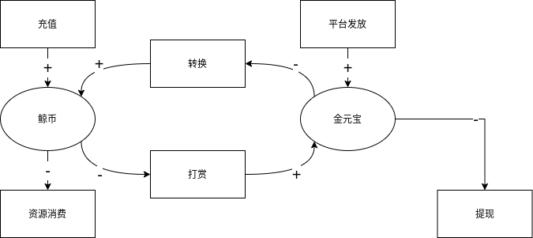

# Kesci Shop

Kesci.com C 端付费微服务，包括完整的虚拟货币流通流程。

# 货币定义

- 鲸币：主要货币，可充值
- 金元宝：奖励货币，可提现



# 事务

为满足灵活的业务需求，应将核心功能与业务功能拆分成不同的微服务。因此需要对基础事务流程做定义。事务必须满足 ACID 特性：

- **A**tomicity: 每次事务仅可能有 2 种结果：成功或失败。且每种结果所导致的最终状态可以预见
- **C**onsistency: 每个事务都由合法的数据流组成
- **I**solation: 并发的事务与线性的事务等效。即事务的顺序不重要
- **D**urability: 事务生效后所造成的效果会永久储存

为满足如上需求，有 2 种解决方案[1][handling-transactions-in-the-microservice-world] [2][patterns-for-distributed-transactions-within-a-microservices-architecture]：

- prepare-commit(2-phase)
- eventual consistency/compensation(Saga)

prepare-commit 执行事务时首先在中央调度服务中生成一个全局进程，然后生成所需的各微服务本地进程，在微服务本地进程都做好准备后(prepared)，获取全局锁，最后所有微服务同时执行事务。各微服务本地在未获取全局锁时不能执行事务，因此可以保证同一物理时刻仅有一个事务在执行。

eventual consistency/compensation 执行事务时将子事务以时间顺序线性排列，上一个子事务成功后执行下一个子事务，上一个子事务失败后按反向顺序执行已经执行过子事务的 rollback。子事务在设计上必须保证 ACID 特性。因此事务可以确保 ACID 特性。

综上所述，两种方案的优缺点列表如下：

|                    | 2-phase | Saga |
| ------------------ | ------- | ---- |
| scalable           | ✗       | ✓    |
| read isolation     | ✓       | ✗    |
| async non-blocking | ✗       | ✓    |

因此应优先尝试 Saga 方法。所有微服务的方法都应提供 rollback 方法。

Saga 有 2 种实现方式：choreography 和 orchestration。

- **Choreography:** 各微服务链式反应完成事务和回滚，业务逻辑写在微服务中
- **Orchestration:** 一个中央编排服务依次触发其它微服务，业务逻辑写在编排服务中。

相对来说 Choreography 更能适应大规模体系，但需要更多的维护人力，实现复杂业务时代码逻辑会更复杂。而 Orchestration 则更适应小规模体系，且能灵活适应复杂的业务需求。因此应采用 Orchestration 方法[1][saga]。

在此规划中，由业务模块负责实现业务逻辑和回滚，核心模块则在业务模块触发下执行核心事务和回滚。原则上核心模块之间无直接依赖关系，且核心模块提供的 API 自带 ACID 特性。

## 货币管理（核心）

货币管理服务应仅处理货币流转，如充值、支付、赠与。应通过传统 HTTP 同步式返回结果。

另外需要提供辅助 API：

1. 获取账户余额
2. 获取货币流转状态

## 商品管理（核心）

商品管理应仅处理商品的状态，如上架、价格、折扣。应通过传统的 HTTP 同步时返回结果。

## 订单管理（核心）

订单管理应仅处理订单的状态，如 创建、变更状态。应通过 HTTP 同步式返回结果。

## 业务模块

业务模块应管理业务逻辑和回滚。

## Rollback

为确保事务的 Atomicity，当事务中途失败后应将所有已执行的步骤回滚。回滚逻辑如下：

```text
业务模块发现错误 => 业务模块开始回滚 => 触发商品、订单、货币模块的回滚 => 回滚完成并返回结果
```

# Contributors

- [张筱](https://gitlab-a3uxyvfhkudlt7.kesci.com/onichandame)

[handling-transactions-in-the-microservice-world]: https://medium.com/swlh/handling-transactions-in-the-microservice-world-c77b275813e0
[patterns-for-distributed-transactions-within-a-microservices-architecture]: https://developers.redhat.com/blog/2018/10/01/patterns-for-distributed-transactions-within-a-microservices-architecture/
[saga]: https://microservices.io/patterns/data/saga.html
